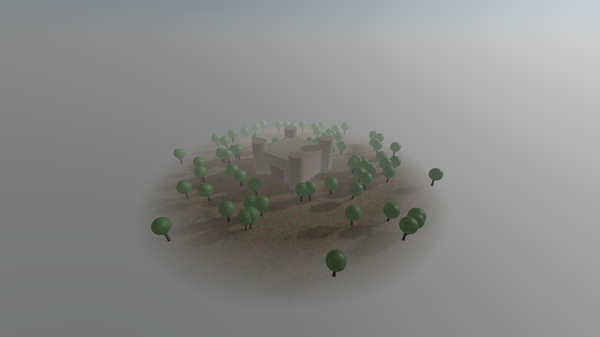

# Hunted_Castle

  

This is a repo for my first Three.js project, this is a creative spin off of lesson 16 from the Three.js Journey course by Bruno Simon
Instead of making a haunted house I made a Huanted castle.

  

I used primitive for all the objects in the scene, for the trees I made a group for every tree and a big group for the trees, I also did optimization for the textures size, and finally deployed the project on vercel.
Link: https://haunted-castle.vercel.app/

  

